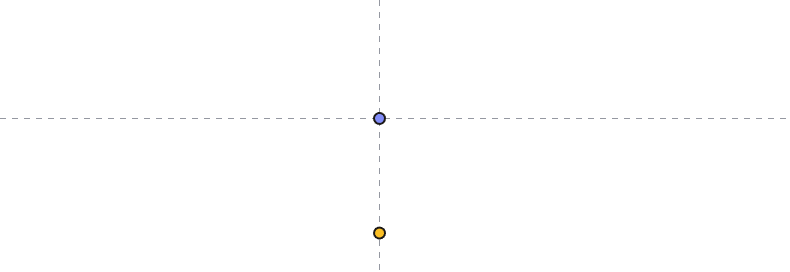

Equity Curve               year-mm-dd => year-mm-dd  Asset backtest timefrae

Performance Metrics
PNL:
7324.67 (73.25%)
Win rate:
52.63%
Sharpe ratio:
1.29
Smart Sharpe:
0.00
Sortino ratio:
2.31
Smart Sortino:
0.00
Calmar ratio:
2.39
Omega ratio:
1.42
Serenity index:
0.00
Average win/loss:
0.00
Average win:
944.79
Average loss:
886.99

Risk Metrics
Total losing streak:
4
Largest losing trade:
-1507.47
Largest winning trade:
2139.53
Total winning streak:
6
Current streak:
2
Expectancy:
77.10 (0.77%)
Expected net profit:
77.10
Average holding period:
30081.47
Gross profit:
47239.30
Gross loss:
-39914.64
Max drawdown:
-30.81

Trade Metrics
Total trades:
95
Total winning trades:
50
Total losing trades:
45
Starting balance:
10000.00
Finishing balance:
17324.67
Longs count:
35
Longs percentage:
36.84
Shorts percentage:
63.16
Shorts count:
60
Fee:
5169.98
Total open trades:
0
Open PL:
0.00

